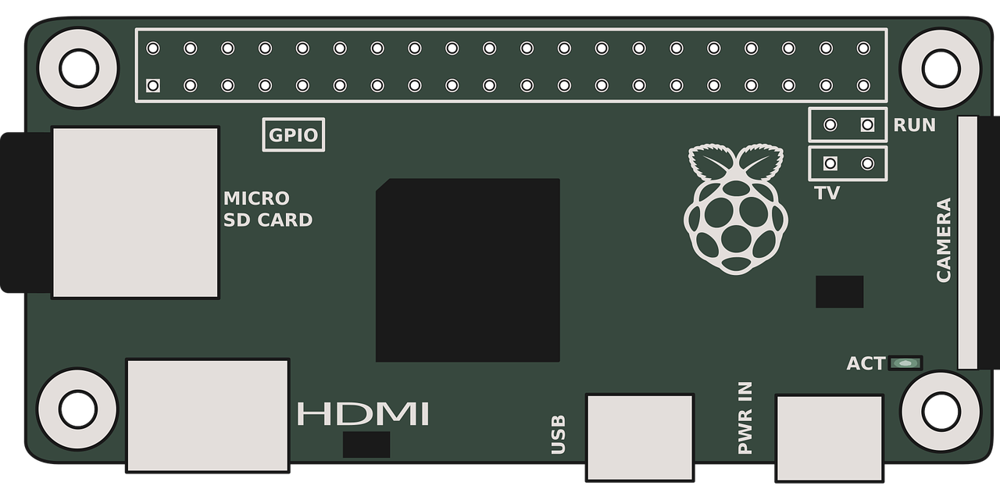
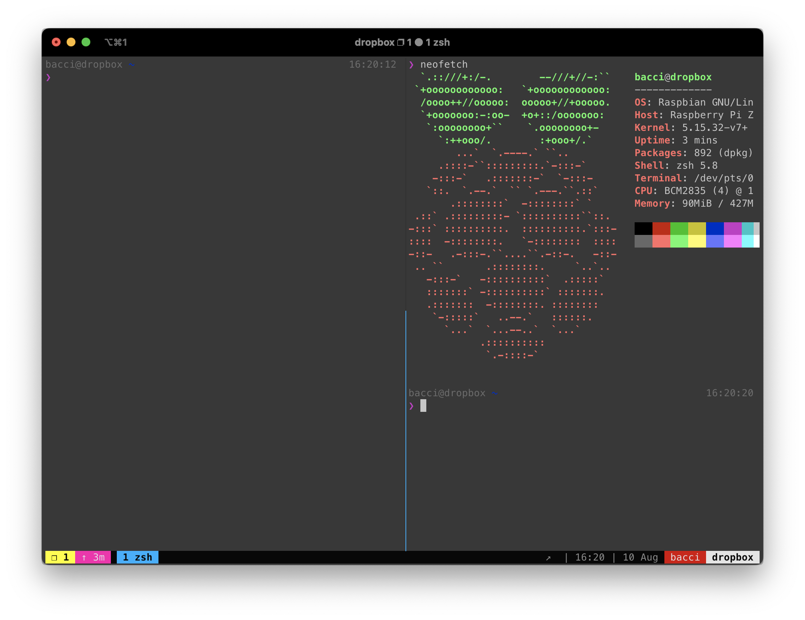

<!-- Improved compatibility of back to top link: See: https://github.com/othneildrew/Best-README-Template/pull/73 -->

<!--
*** Thanks for checking out the Best-README-Template. If you have a suggestion
*** that would make this better, please fork the repo and create a pull request
*** or simply open an issue with the tag "enhancement".
*** Don't forget to give the project a star!
*** Thanks again! Now go create something AMAZING! :D
-->

<!-- PROJECT LOGO -->
 

  

<h3 align="center">Dropbox Weaponizer</h3>

  

    Weaponizing a Raspberry Pi for pentesting, using Ansible Playbooks 🥊
     
    <a href="https://docs.ansible.com/"><strong>Explore the docs »</strong></a>
     
     
    <a href="https://github.com/GiovanniBaccichet/">Author 👨🏻‍💻</a>
    ·
    <a href="https://github.com/GiovanniBaccichet/dropbox-weaponizer/issues">Report Bug 🪳</a>
    ·
    <a href="https://github.com/GiovanniBaccichet/dropbox-weaponizer/issues">Request Feature ✨</a>
  

<!-- TABLE OF CONTENTS -->

<!-- ABOUT THE PROJECT -->
## About The Project 🔍

Let's begin by defining what a dropbox is and in which context can become useful.

> A **Dropbox**, sometimes also called a **Jump Box**, is a small device that you can hide somewhere within the physical location that you are targeting. Getting the device into the location will sometimes take other skills, such as social engineering, or even a little breaking and entering, to get the device into the location. A Dropbox can also be a box sent by the Security Consultant firm to be installed on a network for pen testing from a remote location - *Halton, W., Weaver, B., Ansari, J. A., Kotipalli, S. R., & Imran, M. A. (2017). Penetration Testing: A Survival Guide (1st ed.). Packt Publishing*.

For this purpose, one of the best fits with respect to the hardware to use, is the **Raspberry Pi Zero 2**.

  

(<a href="#readme-top">back to top</a>)

### Built With

- [Ansible](https://www.ansible.com/): it is an open source community project sponsored by Red Hat, it's the simplest way to automate IT
- [Raspberry Pi OS](https://www.raspberrypi.com/software/)

(<a href="#readme-top">back to top</a>)

<!-- FEATURES -->
## Features 💣

Main features description (TBA).

  

(<a href="#readme-top">back to top</a>)

### Tools and Components

A brief summary of the primary tools that this Ansible Playbook is going to install and configure (dependencies are omitted):

|  Category | Name   |      Description      | Included |
|:-----------:|----------|-------------|:------:|
| 📡 | Aircrack-ng Suite |  TBA | 🔴 |
| 🕸 | Bettercap |    TBA   |  🔴 |
| 🔒 | fail2ban | TBA |    🟢 |
| 👨🏻‍💻 | git | TBA |    🟢 |
| 📡 | [Kismet](https://www.kismetwireless.net/) | TBA |    🔴 |
| 👨🏻‍💻 | [log2ram](https://github.com/azlux/log2ram) | TBA |    🟢 |
| 🕸 | macchanger | TBA |    🔴 |
| 🕸 | Nmap | TBA |    🔴 |
| 📡 | [Probequest](https://github.com/SkypLabs/probequest) | TBA | 🔴 |
| 📡 | Reaver | TBA |    🔴 |
| 🕸 | TCPdump | TBA |    🔴 |
| 👨🏻‍💻 | Tmux | TBA |    🟢 |
| 🔒 | ufw | TBA |    🟢 |
| 📡 | Wifite | TBA |    🔴 |
| 🕸 | Wireshark | TBA |    🔴 |
| 👨🏻‍💻 | Zsh | TBA |    🟢 |

`🕸 Networking | 🔒 Security | 👨🏻‍💻 Utility | 📡 Wireless`

(<a href="#readme-top">back to top</a>)

<!-- GETTING STARTED -->
## Getting Started 🏗

This is an example of how you may give instructions on setting up your project locally.
To get a local copy up and running follow these simple example steps.

Ansible commands instructions (TBA).

(<a href="#readme-top">back to top</a>)

<!-- USAGE EXAMPLES -->
## Usage 

Use this space to show useful examples of how a project can be used. Additional screenshots, code examples and demos work well in this space. You may also link to more resources.

_For more examples, please refer to the [Documentation](https://example.com)_

(<a href="#readme-top">back to top</a>)

<!-- ROADMAP -->
## Roadmap 🚸

- [X] `raspi-config` (locale, timezone, expand filesystem, etc.)
- [X] Security hardening (users, SSH w/ key-auth, fail2ban, firewall, etc.)
- [ ] Install all tools mentioned (see previous section)
- [ ] MAC randomization on all interfaces
- [X] Bluetooth PAN w/ hotspot
- [ ] Auto SSH to domain
- [ ] Self-destruct mechanism

See the [open issues](https://github.com/GiovanniBaccichet/dropbox-weaponizer/issues) for a full list of proposed features (and known issues).

(<a href="#readme-top">back to top</a>)

<!-- CONTRIBUTING -->
## Contributing ♥️

Contributions are what make the open source community such an amazing place to learn, inspire, and create. Any contributions you make are **greatly appreciated**.

If you have a suggestion that would make this better, please fork the repo and create a pull request. You can also simply open an issue with the tag "enhancement".
Don't forget to give the project a star! Thanks again!

1. Fork the Project
2. Create your Feature Branch (`git checkout -b feature/AmazingFeature`)
3. Commit your Changes (`git commit -m 'Add some AmazingFeature'`)
4. Push to the Branch (`git push origin feature/AmazingFeature`)
5. Open a Pull Request

(<a href="#readme-top">back to top</a>)

<!-- LICENSE -->
## License 📑

Distributed under the `GPLv3` License. See `LICENSE` for more information.

(<a href="#readme-top">back to top</a>)

<!-- CONTACT -->
## Contact 📬

Your Name - [@Giovanni_Bacci](https://twitter.com/Giovanni_Bacci) - `github[at]baccichet[dot]org`

Project Link: [https://github.com/GiovanniBaccichet/dropbox-weaponizer](https://github.com/GiovanniBaccichet/dropbox-weaponizer)

(<a href="#readme-top">back to top</a>)

<!-- ACKNOWLEDGMENTS -->
## Acknowledgments 📓

* [Oh My Zsh - a delightful & open source framework for Zsh](https://ohmyz.sh/)
* [Fish-like autosuggestions for zsh](https://github.com/zsh-users/zsh-autosuggestions)
* [🇫🇷 Oh my tmux!](https://github.com/gpakosz/.tmux)
* [Bluetooth Network Access Point for Raspberry Pi](https://github.com/bablokb/pi-btnap)

(<a href="#readme-top">back to top</a>)

